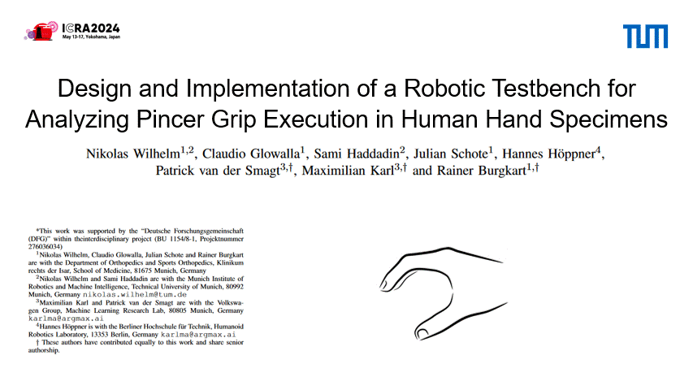
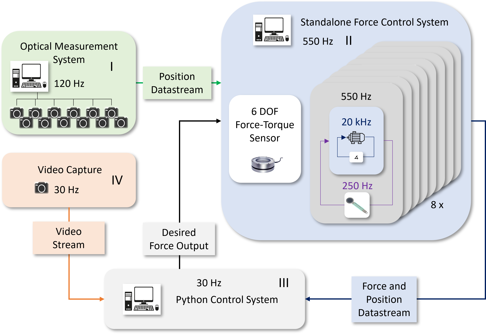
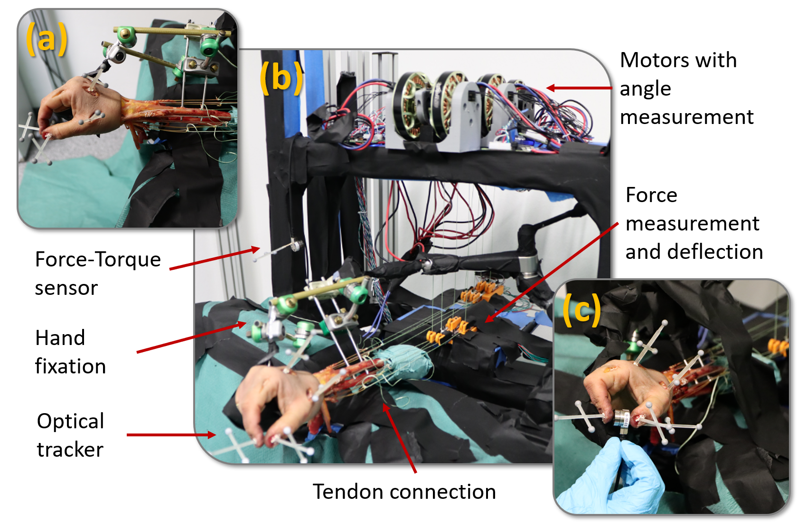

# Design and Implementation of a Robotic Testbench for Analyzing Pincer Grip Execution in Human Hand Specimens

This repository contains the research, implementation measurement results and evaluation files for an innovative testbench designed to analyze pincer grip execution in human hand specimens.

## Abstract

This study presents an innovative test rig engineered to explore the kinematic and viscoelastic characteristics of human specimen hands. The rig features eight force-controlled motors linked to muscle tendons, enabling precise stimulation of hand specimens. Hand movements are monitored through an optical tracking system, while a force-torque sensor quantifies the resultant fingertip loads. Employing this setup, we successfully demonstrated a pincer grip using a cadaver hand and measured both muscle forces and grip strength. Our results reveal a nonlinear relationship between tendon forces and grip strength, which can be modeled by an exponential fit. This investigation serves as a nexus between biomechanical and robotics-focused research, providing critical insights for the advancement of robotic hand actuation and therapeutic interventions.

## How to Use

- Install the "requirements.txt"
- Modify the respective config file as desired for your train run.
- Run "python src/main.py"

## Results 

## Key Figures

<table>
  <tr>
    <td>
      
       
      <em>Figure 1: Overview of the autoencoder architecture for kinematics.</em>
    </td>
    <td>
      
       
      <em>Figure 2: Illustration of the test rig and setup.</em>
    </td>
  </tr>
</table>

## Key Findings

- Linked tendon forces to grip strength via an innovative testbench.
- Enhanced measurement precision with external tracking.
- Filled gaps in biomechanic data collection methods.

## Limitations

The study provides insights into the biomechanics of the human hand but faced challenges like signal loss in optical trackers and changes in the biomechanical properties of cadaveric specimens, affecting the reliability of data and the hand's response to actuation. Moreover, determining joint angles introduced potential inaccuracies due to manual identification, environmental conditions, and a limited diversity of hand specimens, which may restrict the findings' applicability.

## Conclusion

This study explores the biomechanics of the human hand, emphasizing the connection between tendon forces and grip strength, using a unique interdisciplinary approach that combines robotics and biomechanics to create a complex and comprehensive testbench. The findings, supported by precise external tracking and robust data on hand mechanics, contribute significantly to the field by enhancing existing methodologies and providing a solid foundation for future biomechanic simulations and research.

## References

Please refer to the paper for a comprehensive list of references.
